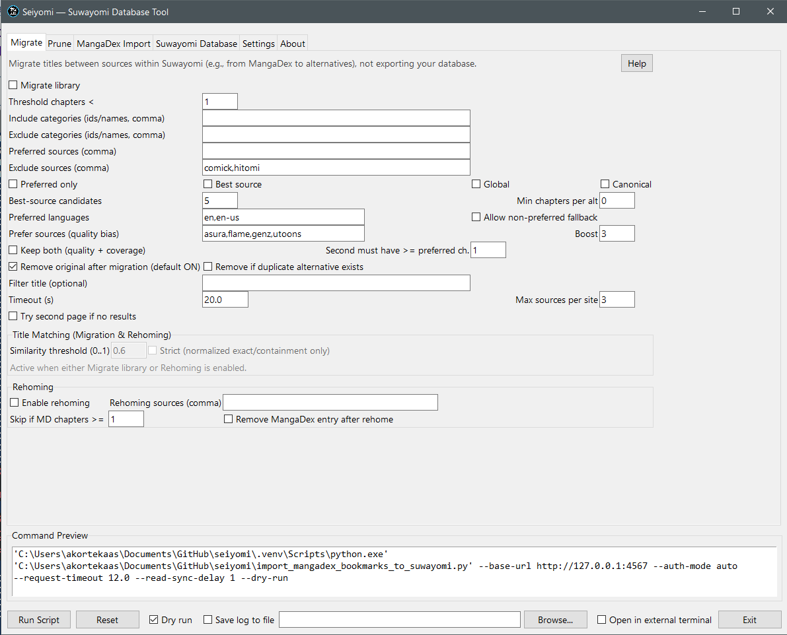

# Seiyomi — Suwayomi Database Tool (with GUI)

<div align="center">


</div>

A desktop helper for Suwayomi that brings together:

- MangaDex import (follows, statuses, custom lists, read chapters)
- Library migration between sources (rehoming, best-source selection)
- Library pruning (duplicates, non-preferred languages)
- Suwayomi connection utilities (auth modes, categories, throttling)

It includes a Tkinter-based GUI with live command preview and presets, plus a direct command-line interface for automation.

---

## Preview (Migrate tab)

<div align="center">



</div>

---

## System Requirements

- Windows 10/11 (official support; packaged EXE available)
- Suwayomi server reachable (e.g., `http://127.0.0.1:4567`)
- Python 3.11+ if running scripts directly
- Optional: PowerShell 7 (`pwsh`) for opening an external terminal from the GUI (quiet mode doesn’t require it)

## Why “Seiyomi”?

- Name: Seiyomi (整読み) combines 整 (sei, “organize/order”) with 読み (yomi, “reading”).
- Meaning: “Organize reading” — a nod to how this tool manages, migrates, and tidies your Suwayomi library.
- Icon: A white 整 glyph on black with a light‑blue ring, optimized to scale cleanly as a 16–256 px app icon.

This mirrors the tradition of names like Tachiyomi (立ち読み, “stand and read”) and Suwayomi (座り読み, “sit and read”). Seiyomi focuses on organizing and curating your library.

---

## Features

- GUI with tabs for Migrate, Prune, MangaDex Import, Suwayomi Database, Settings, and About
- Command Preview: see the exact command that will run (including log piping)
- General controls on a unified bottom bar: Dry run, Save log, Log path, Run, Reset, Exit
- Per‑tab description and Help button (opens in-app manual viewer)
- Tooltips on nearly every option explaining what to enter and what it does
- Presets for common workflows (e.g., Prefer English Migration)
- Works with packaged EXE or Python script directly

---

## Install / Run

- Requirements: Python 3.11+ (or use provided EXE if available), a running Suwayomi server (e.g. <http://127.0.0.1:4567>)
- Windows: double‑click the GUI script, or run from PowerShell:
  
  ```powershell
  # In repo root
  .\.venv\Scripts\python.exe .\gui_launcher_tk.py
  ```

- Or run the CLI directly:
  
  ```powershell
  python import_mangadex_bookmarks_to_suwayomi.py --help
  ```

See the full user manual in `USER_MANUAL.md` for step-by-step guides and copy/paste command examples.

---

## Tabs Overview

- Migrate
  - Migrate titles between sources within Suwayomi, pick best alternatives by chapter coverage, optionally keep both
  - Includes rehoming for zero‑chapter entries
- Prune
  - Remove zero/low‑chapter duplicates and entries without preferred‑language chapters
- MangaDex Import
  - Login, fetch follows, import statuses and read chapters, map statuses to categories, import custom lists
- Suwayomi Database
  - Connect to Suwayomi (auth modes: auto/basic/simple/bearer), list categories, open UI, set timeouts/throttle
- Settings
  - Debug output and presets
- About
  - App summary, environment info, quick links (README, Manual, Project Folder)

Each tab starts with a short description and a Help button that opens the manual to the relevant section.

---

## Command Preview and Logging

- Command Preview updates live as you change fields
- Bottom bar controls apply to all tabs:
  - Dry run: simulate without changing your library
  - Save log to file: tee console output to a file (pick a path)
  - Run Script: executes the previewed command
  - Reset: restores defaults

---

## CLI Quick Examples

List categories

```powershell
python import_mangadex_bookmarks_to_suwayomi.py --base-url http://127.0.0.1:4567 --list-categories
```

Import follows + statuses + read chapters (dry run)

```powershell
python import_mangadex_bookmarks_to_suwayomi.py `
  --base-url http://127.0.0.1:4567 `
  --from-follows `
  --md-username USER `
  --md-password PASS `
  --import-reading-status `
  --status-category-map completed=5,reading=2,on_hold=7,dropped=8,plan_to_read=9 `
  --import-read-chapters `
  --read-sync-delay 1 `
  --dry-run
```

Import read chapters across sources (apply by chapter number when ahead) and write a live missing report

```powershell
python import_mangadex_bookmarks_to_suwayomi.py `
  --base-url http://127.0.0.1:4567 `
  --from-follows `
  --md-username USER `
  --md-password PASS `
  --import-read-chapters `
  --read-sync-number-fallback `
  --read-sync-across-sources `
  --read-sync-only-if-ahead `
  --read-sync-delay 2 `
  --max-read-requests-per-minute 240 `
  --missing-report .\reports\md_missing_reads.csv
```

Flags added for read sync

- `--import-read-chapters`: Fetch MangaDex read chapter UUIDs and mark them in Suwayomi (MangaDex source).
- `--read-sync-number-fallback`: When UUIDs don’t match (e.g., migrated to other sources), mark chapters by chapter number.
- `--read-sync-across-sources`: Apply read marks to same‑title entries under other sources too (normalized title match).
- `--read-sync-only-if-ahead`: Only mark if MangaDex progress is ahead of the target entry’s current read progress.
- `--read-sync-delay <sec>`: Wait after adding a manga before syncing reads (let chapters populate).
- `--max-read-requests-per-minute <n>`: Throttle read mark API calls.
- `--missing-report <path.csv>`: Write a CSV of titles that have missing chapters (or chapters not yet loaded). The file is created up‑front with a header and updated live as the run progresses.

Notes

- Chapter-number matching uses canonical fractional rules: `.1–.4` are canonical; `.5` is canonical only if splits exist for the base chapter; `.6+` canonical when present; title hints like “extra/omake/special” are excluded.
- The missing report includes only rows with `missing > 0` or `unknown` (no chapters loaded yet). Don’t keep the CSV open in Excel during the run or appends may fail due to file locking.

Migrate existing library (rehoming preferred sources)

```powershell
python import_mangadex_bookmarks_to_suwayomi.py `
  --base-url http://127.0.0.1:4567 `
  --migrate-library `
  --migrate-threshold-chapters 1 `
  --migrate-sources "bato.to,mangabuddy,weeb central,mangapark" `
  --exclude-sources "comick,hitomi" `
  --migrate-title-threshold 0.7 `
  --best-source `
  --best-source-canonical `
  --best-source-candidates 4 `
  --min-chapters-per-alt 5 `
  --migrate-max-sources-per-site 3 `
  --migrate-timeout 25 `
  --migrate-remove-if-duplicate
```

Quiet read-sync (no debug/logging)

If you only want to sync MangaDex read markers into Suwayomi without extra output, use one of these minimal commands:

```powershell
# Sync ALL follows from MangaDex (quiet)
python import_mangadex_bookmarks_to_suwayomi.py `
  --base-url http://127.0.0.1:4567 `
  --from-follows `
  --md-username YOUR_USER `
  --md-password YOUR_PASS `
  --no-add-library `
  --import-read-chapters `
  --read-sync-number-fallback `
  --max-read-requests-per-minute 240 `
  --no-progress

# Or: sync only IDs from a file (one MangaDex UUID per line)
python import_mangadex_bookmarks_to_suwayomi.py `
  --base-url http://127.0.0.1:4567 `
  .\ids.txt `
  --md-login-only `
  --md-username YOUR_USER `
  --md-password YOUR_PASS `
  --no-add-library `
  --import-read-chapters `
  --read-sync-number-fallback `
  --max-read-requests-per-minute 240 `
  --no-progress
```

How read marks are applied

- The tool sets chapter read flags via GraphQL mutations (the same path the WebUI uses): `updateChapters` (batch) and `updateChapter` (single).
- REST write endpoints are not required and may be disabled on some servers; GraphQL is sufficient provided your auth mode permits it.
- If marks don’t stick, ensure your server’s GraphQL endpoint is reachable and that your auth mode (auto/basic/simple/bearer) allows write mutations.

---

## Web UI Userscripts (Optional)

See `userscripts/README.md` for a Tampermonkey/Violentmonkey script that adds a “Sort: Recently Published” button to the Suwayomi web UI, so you can order titles by the latest published chapter date rather than database added date. Adjust selectors as needed for your UI version.

---

## Troubleshooting

- Use Dry run + Command Preview to validate before running
- Turn on Debug output in Settings for verbose logs
- If auth fails: try different auth modes (auto/basic/simple/bearer) and tokens
- If migration returns few results: raise best‑source candidates and timeout, and consider Preferred only off
- If migration/rehoming picks the wrong title: tune title matching with `--migrate-title-threshold` (default 0.6), or enforce strict matches via `--migrate-title-strict`
- Status mapping issues: enable Map debug and Print status summary

For details, open the in‑app manual (Help button on each tab).

---

## Safety & Defaults

- Non-destructive by default: migrations do not remove originals unless you explicitly enable removal.
- Destructive options in the GUI are marked in red with “(destructive)” labels.
- The first time you enable any destructive action, the GUI shows a confirmation dialog with a “Don’t show again” option.

---

## Title Matching (Migration & Rehoming)

Some sources return popular/new lists even for specific searches. To prevent unrelated picks:

- `--migrate-title-threshold <0..1>`: Require a minimum normalized title similarity (Jaccard over cleaned tokens). Default: `0.6`.
- `--migrate-title-strict`: Require normalized exact/containment matches; disables fuzzy-only matches.

These checks are applied before selecting candidates for both migration and rehoming. If no candidates pass, that source is skipped.

---

## License

MIT. Respect site policies and support authors/artists.
